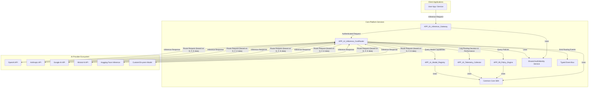

# APP_12_Inference_CostRouter

## Problem Statement

The proliferation of AI models and providers has introduced significant complexity and cost variability into AI-powered applications. Developers and organizations face a critical challenge: how to dynamically select the optimal AI model or provider for a given inference request, balancing factors like cost, latency, quality, and compliance, without hardcoding vendor-specific logic. This leads to:

1.  **Unpredictable Costs:** Inference costs fluctuate wildly across providers (OpenAI, Anthropic, Google, Mistral, etc.) and even within different models from the same provider. Without intelligent routing, organizations overspend.
2.  **Suboptimal Performance:** Applications might use a high-latency model when a faster, equally capable alternative is available, impacting user experience.
3.  **Vendor Lock-in:** Direct integration with specific AI APIs creates rigid architectures, making it difficult to switch providers or leverage new, more efficient models.
4.  **Lack of Control:** Organizations lack granular control over where their data is processed, which models are used for specific tasks, and how to enforce budget constraints.
5.  **Operational Overhead:** Manually managing and updating routing logic for multiple models and providers is time-consuming and error-prone.

The APP_12_Inference_CostRouter solves these problems by providing a dynamic, policy-driven routing layer that sits between the application and various AI inference providers, ensuring optimal resource utilization and cost efficiency.

## Architecture Diagram

**Key Components:**

*   **Request Interceptor:** Receives inference requests from `APP_01_Inference_Gateway`.
*   **Policy Evaluator:** Consults `APP_09_Policy_Engine` to retrieve active routing policies (e.g., "prioritize cheapest for non-sensitive data," "use highest quality for critical tasks," "route PII to specific region").
*   **Model & Provider Selector:** Queries `APP_11_Model_Registry` for available models, their capabilities, and current pricing/performance data (potentially enriched by `APP_10_Telemetry_Collector`).
*   **Dynamic Router:** Based on policies and real-time data, selects the optimal AI provider and model.
*   **Provider Adapters:** Standardized interfaces for interacting with various AI vendor APIs (OpenAI, Anthropic, Google, Mistral, etc.), abstracting vendor-specific details.
*   **Telemetry Emitter:** Sends detailed routing decisions, latency, and cost metrics to `APP_10_Telemetry_Collector` via the `Typed Event Bus`.

## Revenue Surface

The APP_12_Inference_CostRouter offers multiple monetization avenues:

1.  **Transaction Fees (Micro-SaaS):** A small percentage fee (e.g., 0.5% - 2%) on the total inference cost routed through the system. This aligns the router's success with the user's cost savings.
2.  **Tiered Service Plans:**
    *   **Free Tier:** Basic routing, limited policies, standard analytics.
    *   **Pro Tier:** Advanced routing algorithms (e.g., real-time market-based optimization), more complex policy rules, higher throughput, priority support.
    *   **Enterprise Tier:** Dedicated instances, custom integrations, SLA guarantees, advanced compliance features, multi-region deployment, white-glove support.
3.  **Premium Analytics & Reporting:** Offering detailed dashboards, cost breakdown reports, performance benchmarks, and predictive cost analysis as a paid add-on.
4.  **Policy Management Tools:** Charging for advanced UI/API access to define, test, and manage complex routing policies, including A/B testing of routing strategies.
5.  **Managed Provider Integrations:** Offering pre-built, optimized integrations for niche or on-premise AI models, or professional services for custom provider onboarding.

## Cost Drivers

The primary operational costs for APP_12_Inference_CostRouter include:

1.  **Compute Resources:** CPU/memory for running the routing engine, policy evaluation, and API proxying. This scales with the volume of inference requests.
2.  **API Calls to AI Providers:** While the router *optimizes* external API costs, it still incurs costs for pre-flight checks (e.g., token estimation, pricing lookups) and potentially for failed requests.
3.  **Data Storage:** Storing routing logs, historical performance metrics, and policy configurations. This scales with data retention policies.
4.  **Network Egress:** Data transfer costs for routing requests and responses between the router and AI providers, and between the gateway and the router.
5.  **Dependency Costs:** Costs associated with running `APP_09_Policy_Engine`, `APP_10_Telemetry_Collector`, and `APP_11_Model_Registry` which the router heavily relies on.
6.  **Developer & Maintenance:** Ongoing development, security patching, infrastructure management, and customer support.

## Failure Modes

1.  **Provider Outage/Degradation:** If the selected AI provider or model becomes unavailable or experiences high latency, the router must detect this and failover to an alternative or return an appropriate error.
2.  **Policy Misconfiguration:** Incorrectly defined routing policies can lead to suboptimal choices (e.g., always picking an expensive model), routing failures, or compliance breaches.
3.  **Latency Bottleneck:** The router itself could become a performance bottleneck if not efficiently designed, adding overhead to every inference request.
4.  **Cost Estimation Inaccuracy:** If the cost models for various providers are outdated or incorrect, the router might make non-optimal cost decisions, leading to unexpected bills.
5.  **Dependency Failures:** Failure of `APP_09_Policy_Engine`, `APP_10_Telemetry_Collector`, or `APP_11_Model_Registry` can cripple the router's ability to make informed decisions.
6.  **Security Vulnerabilities:** Compromise of API keys for AI providers or the routing policy configuration could lead to unauthorized usage or data exposure.
7.  **Rate Limiting:** The router might hit rate limits imposed by AI providers if not configured with appropriate backoff and retry mechanisms.

## Unit-Economics Visibility

The APP_12_Inference_CostRouter's value is directly tied to its ability to optimize unit economics for AI inference:

*   **Tokens:** The router's primary goal is to minimize the cost per 1k input/output tokens by intelligently selecting providers and models based on real-time pricing and policy constraints. Users can see how many tokens were routed through which provider and the associated cost savings.
*   **Compute (Router Overhead):** The cost of running the router itself (CPU/memory per request) is a measurable overhead. This cost is typically very low per request, aiming for fractions of a cent, and is offset by the savings generated.
*   **Storage:** Cost per GB for storing routing logs and performance data. This is a fixed operational cost that scales with data retention and volume.
*   **API Calls (External):** The router provides visibility into the number of API calls made to each external AI provider, their success rates, and the actual costs incurred, allowing for granular budget tracking.

**Value Proposition:** For every $1 spent on APP_12_Inference_CostRouter's service, customers should realize $X in savings on their overall AI inference spend, or achieve Y% improvement in latency/quality for critical workloads. The unit economics are clear: the cost of routing is a small fraction of the savings it generates.

## Replaceable Dependencies

The APP_12_Inference_CostRouter is designed with a strong emphasis on modularity and replaceable dependencies to avoid vendor lock-in and ensure future adaptability:

*   **AI Provider Adapters:** All interactions with external AI vendors (OpenAI, Anthropic, Google, Mistral, etc.) are abstracted behind a common `IInferenceProvider` interface. This allows new providers to be added, or existing ones swapped out, by simply implementing this interface.
*   **Policy Engine:** The integration with `APP_09_Policy_Engine` is via a well-defined `IPolicyEvaluator` interface. This means the underlying policy enforcement mechanism could be replaced (e.g., from a rule-based engine to a machine learning-driven one) without impacting the core routing logic.
*   **Telemetry System:** All logging and metric emission uses the `Typed Event Bus` and a `ITelemetryEmitter` interface. This allows the backend telemetry collector (`APP_10_Telemetry_Collector`) to be swapped or integrated with different monitoring solutions (e.g., Prometheus, Datadog, Splunk).
*   **Configuration Management:** All operational parameters (API keys, thresholds, default policies) are externalized via environment variables, configuration files, or a central configuration service, making them easily modifiable without code changes.
*   **Shared Core SDK:** Leverages the `Common Core SDK` for foundational utilities, authentication, and data contracts, ensuring consistency and easy upgrades across the ecosystem.

## Obvious Enterprise Upsell Paths

1.  **Advanced Policy Enforcement:** Offering sophisticated policy capabilities such as data residency controls (e.g., "route all EU data to models hosted in EU regions"), PII redaction/masking policies, and fine-grained access controls for routing rules.
2.  **Real-time Market Optimization:** AI-driven routing that dynamically adjusts based on live pricing, provider load, and performance metrics, potentially leveraging predictive analytics for optimal cost/latency.
3.  **Dedicated Instances & Private Deployments:** For enterprises with strict security, compliance, or performance requirements, offering dedicated cloud instances, private VPC deployments, or even on-premise versions of the router.
4.  **Custom Model Integration:** Professional services and premium features for integrating and optimizing routing for an enterprise's proprietary internal models or niche industry-specific AI services.
5.  **Enhanced Compliance & Audit Trails:** Providing immutable audit logs of every routing decision, integration with enterprise SIEM systems, and features to demonstrate adherence to regulatory requirements (e.g., GDPR, HIPAA).
6.  **SLA-Backed Performance Guarantees:** Offering premium support tiers with guaranteed uptime, latency targets, and dedicated engineering resources.
7.  **Multi-Cloud / Hybrid Cloud Routing:** Capabilities to route requests seamlessly across different cloud providers and on-premise infrastructure, optimizing for cost, latency, and data gravity.

## Tension in Design

The APP_12_Inference_CostRouter embodies a fundamental tension between **Cost vs. Quality** and **Speed vs. Safety**.

*   **Cost vs. Quality:** This is the core design tension. The router's primary function is to navigate this trade-off. Users define their acceptable balance through policies:
    *   A policy might prioritize the absolute lowest cost, even if it means slightly lower quality or higher latency for non-critical tasks.
    *   Another policy might demand the highest quality model, regardless of cost, for critical applications like medical diagnostics or legal analysis.
    *   The architecture must allow for dynamic switching between these priorities based on request context, user profiles, or time of day. This tension is resolved by the `Policy Evaluator` and `Model & Provider Selector` components, which are designed to interpret and enforce these user-defined trade-offs.

*   **Speed vs. Safety:** Routing decisions must be made with minimal latency to avoid becoming a bottleneck. However, these decisions also need to incorporate safety and compliance checks (e.g., data residency, content moderation policies).
    *   The `Request Interceptor` and `Dynamic Router` are optimized for speed, using cached data and efficient algorithms.
    *   The integration with `APP_09_Policy_Engine` introduces the "safety" aspect, ensuring that even fast decisions adhere to predefined rules. The tension is managed by designing the policy evaluation to be highly performant, potentially pre-compiling rules or using efficient lookup mechanisms, to minimize its impact on overall request latency while still enforcing critical safeguards.

This inherent tension is not a flaw but a feature, allowing the system to adapt to diverse business needs and risk appetites.

---

agent_metadata:
  purpose: Intelligent routing of AI inference requests based on cost, latency, quality, and policy constraints across multiple AI providers.
  dependencies:
    - APP_01_Inference_Gateway (upstream request source)
    - APP_09_Policy_Engine (for routing rules and policies)
    - APP_10_Telemetry_Collector (for real-time performance and cost data)
    - APP_11_Model_Registry (for model capabilities, pricing, and availability)
    - Shared Auth/Identity Service (for request authentication and authorization)
    - Typed Event Bus (for emitting routing events and metrics)
    - Common Core SDK (for shared utilities, data contracts, and error handling)
    - Various AI Provider SDKs/APIs (OpenAI, Anthropic, Google, Mistral, etc.)
  invalidation_conditions:
    - Significant changes in AI provider pricing models or API structures.
    - Updates to core routing algorithms or policy evaluation logic.
    - Failure or degradation of dependent services (Policy Engine, Telemetry, Model Registry).
    - Security vulnerabilities in integrated AI provider SDKs or the router itself.
    - Changes in regulatory compliance requirements affecting data routing.
  adjacent_apps:
    - APP_01_Inference_Gateway: Direct upstream consumer.
    - APP_09_Policy_Engine: Provides routing policies.
    - APP_10_Telemetry_Collector: Consumes routing metrics and performance data.
    - APP_11_Model_Registry: Provides model metadata for routing decisions.
    - APP_13_Inference_LoadBalancer: Could work in conjunction for horizontal scaling of a chosen provider.
    - APP_14_Agents_MultiModelOrchestrator: Could use the router to select models for agent sub-tasks.
    - APP_15_Evaluation_BenchmarkingService: Could use router data to evaluate model performance under different routing strategies.
    - APP_21_AI_CostAccounting_Billing: Consumes cost data from the router for billing.
    - APP_37_Governance_AuditTrailEngine: Consumes audit logs of routing decisions.