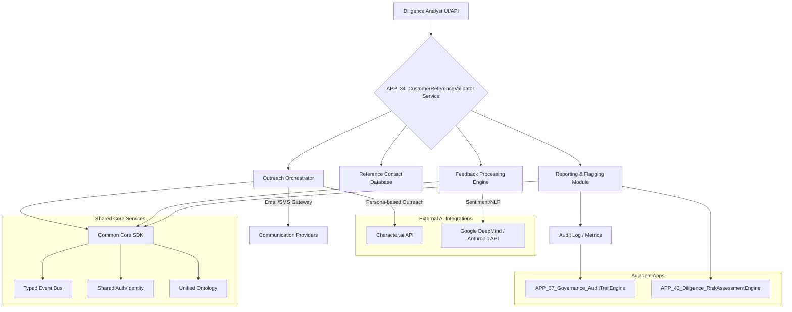

# APP_34_Diligence_CustomerReferenceValidator

An agent-based system designed to automate and scale the initial outreach and analysis of customer references during due diligence processes. It summarizes feedback, identifies key themes, and flags potential concerns, integrating persona-based interaction for more engaging communication.

## Problem Statement

In venture capital, private equity, and M&A, validating customer references is a critical but often time-consuming and inconsistent part of the due diligence process. Manual outreach is slow, difficult to scale across multiple deals, and prone to human bias in interpretation. There's a need for a system that can efficiently initiate contact, gather structured feedback, perform preliminary analysis, and highlight potential red flags, allowing human analysts to focus on deeper qualitative insights.

## Architecture Diagram



**Architectural Tension: Scaled Outreach vs. In-Depth Conversation**
The system is designed to achieve high-volume, scaled outreach, which inherently risks superficial interactions. To mitigate this, it integrates Character.ai to enable persona-based, more engaging, and context-aware initial conversations, attempting to bridge the gap between automation efficiency and the need for nuanced human-like interaction. The tension lies in balancing the speed and breadth of automated processing with the depth and quality of insights typically gained from direct human engagement.

## Revenue Surface

1.  **Subscription Tiers:**
    *   **Basic:** Per-reference processing fee, limited AI agent interactions, standard reporting.
    *   **Pro:** Higher volume, advanced NLP analysis, custom persona templates, integration with common CRM/Diligence tools.
    *   **Enterprise:** Unlimited references, dedicated compute, custom AI persona development, white-glove integration with proprietary systems, enhanced compliance features.
2.  **API Usage:** Pay-as-you-go model for programmatic integration into existing diligence platforms or internal tools.
3.  **Premium Features:**
    *   Advanced thematic analysis and trend identification across multiple references.
    *   Jurisdictional compliance modules for specific regions.
    *   Real-time sentiment monitoring during ongoing outreach.
    *   Customizable feedback questionnaire builders with AI-driven question generation.

## Cost Drivers

1.  **AI API Calls:** Primary cost driver from Character.ai (for persona-based interaction) and Google DeepMind/Anthropic (for NLP, sentiment analysis, summarization). Costs are typically per token, per message, or per API call.
2.  **Compute Resources:** For running the orchestration engine, feedback processing, data storage, and API endpoints.
3.  **Data Storage:** Storing reference contact information, communication logs, raw feedback, processed insights, and audit trails.
4.  **Communication Services:** Costs associated with sending emails or SMS messages via third-party gateways.
5.  **Infrastructure:** Hosting, monitoring, and scaling the application.

## Failure Modes

1.  **AI Hallucination/Misinterpretation:** AI agents might generate inaccurate summaries, misinterpret sentiment, or flag non-existent concerns, leading to false positives or missed critical insights.
2.  **Low Response Rates:** Automated outreach, even with persona-based agents, might be perceived as impersonal, leading to lower engagement and response rates from references.
3.  **Integration Failures:** Downtime or API changes from Character.ai, Google DeepMind, Anthropic, or communication providers could disrupt operations.
4.  **Data Privacy/Security Breaches:** Mishandling sensitive reference contact information or feedback could lead to severe legal and reputational damage.
5.  **Over-Automation Bias:** Over-reliance on automated flagging might cause human analysts to overlook nuanced qualitative feedback that requires deeper human interpretation.
6.  **Jurisdictional Compliance Issues:** Failure to adhere to varying data privacy (e.g., GDPR, CCPA) and communication regulations across different regions.

## agent_metadata

```json
{
  "purpose": "Automate and scale customer reference validation for diligence processes, providing structured feedback and flagging concerns using persona-based AI interaction.",
  "dependencies": [
    "Common Core SDK",
    "Character.ai API",
    "Google DeepMind API",
    "Anthropic API",
    "Email/SMS Gateway (e.g., Twilio, SendGrid)"
  ],
  "invalidation_conditions": [
    "Significant changes in AI vendor APIs (Character.ai, Google DeepMind, Anthropic) requiring major refactoring.",
    "Inability to maintain high reference response rates due to perceived automation or lack of trust.",
    "Major regulatory changes regarding automated outreach or data privacy that cannot be easily adapted.",
    "Persistent issues with AI hallucination or misinterpretation leading to unreliable outputs."
  ],
  "adjacent_apps": [
    "APP_01_Inference_CostRouter",
    "APP_14_Agents_MultiModelOrchestrator",
    "APP_37_Governance_AuditTrailEngine",
    "APP_42_Diligence_DealFlowTracker",
    "APP_43_Diligence_RiskAssessmentEngine",
    "APP_58_Narrative_ModelExplainabilityUI"
  ]
}
```