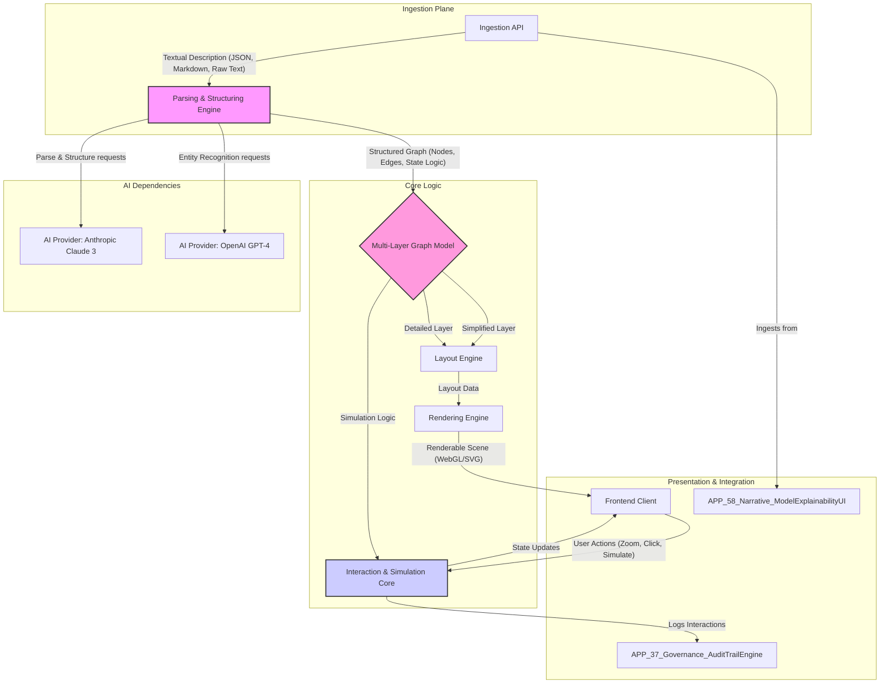

# APP_59_Narrative_MindseyeVisualizer

**Mindseye Visualizer** is a platform that transforms complex, text-based explanations from AI systems into dynamic, interactive, and explorable visualizations. It serves as the visual cortex for the AI ecosystem, making abstract concepts tangible and auditable.

---

## 1. Problem Statement

AI models, particularly in explainability (XAI) and system orchestration, generate vast amounts of descriptive text, logs, and traces. This output, while information-rich, is often a dense "wall of text" that is difficult for human operators, auditors, and developers to intuitively grasp. Static diagrams help, but they fail to capture dynamic relationships, nested complexity, and causal flows.

Mindseye Visualizer solves this by ingesting structured or unstructured text describing a system, process, or model's reasoning and automatically generating a multi-layered, interactive digital twin of that description. Users can "fly through" the explanation, zoom from high-level architecture to individual component states, trigger mini-simulations, and visually verify the logic described by the AI.

## 2. Architecture

The system is designed around a core tension: **Clarity vs. Fidelity**. It must present a clean, understandable visualization (Clarity) without losing the critical, often messy, details of the source explanation (Fidelity).



### Key Components:

*   **Ingestion API**: A REST/gRPC endpoint that accepts textual descriptions. It can handle raw natural language, structured JSON from other ecosystem apps, or domain-specific languages like Mermaid or PlantUML.
*   **Parsing & Structuring Engine**: The "mind" of the system. It uses a multi-pass approach with different LLMs (e.g., Claude 3 for structure, GPT-4 for entity extraction) to convert unstructured text into a formal graph representation. This is the primary AI integration point.
*   **Multi-Layer Graph Model**: This is where the core tension is managed. The raw, high-fidelity graph from the parser is stored. A series of configurable simplification and clustering algorithms generate higher-level, more abstract "views" or layers.
*   **Layout & Rendering Engine**: A backend service that applies various layout algorithms (force-directed, hierarchical, etc.) to the graph layers and prepares a scene graph for the frontend. It can output to different formats like SVG, WebGL (via Three.js), or even static images.
*   **Interaction & Simulation Core**: Manages the real-time aspects. It processes user inputs from the client (pan, zoom, node selection) and runs sandboxed, discrete-step simulations based on the state logic embedded in the graph model.
*   **Frontend Client**: A rich web application (React/Vue + D3.js/Three.js) that renders the visualization and provides the user interface for interaction, layer selection, and simulation control.

## 3. Revenue Surface

Mindseye Visualizer is monetized through a tiered SaaS model with usage-based components, targeting individual developers, teams, and large enterprises.

*   **Primary Metric**: Visualization Complexity Unit (VCU), an aggregate measure of nodes, edges, interactive elements, and simulation steps.

| Tier        | Price/Month      | VCU Quota/Month | Key Features                                                              | Upsell Path                               |
|-------------|------------------|-----------------|---------------------------------------------------------------------------|-------------------------------------------|
| **Developer** | Free             | 500             | Public visualizations only, basic layouts, 2 AI provider integrations.    | Need for privacy, more complexity.        |
| **Pro**       | $79 / seat       | 10,000          | Private visualizations, advanced layouts, simulation engine, API access.  | Need for collaboration, SSO, audit.       |
| **Enterprise**| Custom Pricing   | Unlimited       | SSO/SAML, role-based access, dedicated rendering infra, audit log streaming, custom data source integrations (e.g., Snowflake, Palantir). | Premium support, custom feature dev.      |

### Usage-Based Add-ons:

1.  **Parsing Credits**: Billed per 1M input tokens processed by the underlying LLMs. Enterprise tiers can bring their own LLM keys.
2.  **Advanced Simulation Compute**: Billed per CPU-hour for simulations exceeding the tier's included quota.
3.  **High-Fidelity Rendering**: A premium charge for accessing GPU-accelerated WebGL rendering for exceptionally large or complex graphs.

## 4. Cost Drivers

*   **AI API Consumption**: The Parsing & Structuring Engine is the largest and most variable cost, directly tied to customer usage and the complexity of their input text.
*   **Backend Compute**: The Layout Engine and Simulation Core require significant CPU/GPU resources, especially for real-time interaction with large graphs. This necessitates a scalable container orchestration platform (e.g., Kubernetes).
*   **Data Storage**: Storing the multi-layered graph models, user metadata, and cached rendering artifacts in a database like PostgreSQL or a graph database like Neo4j.
*   **Bandwidth**: Egress costs for serving the rich frontend application and streaming visualization data to clients globally.

## 5. Failure Modes

| Failure Mode                 | Impact                               | Mitigation Strategy                                                                                                                                                           |
|------------------------------|--------------------------------------|-------------------------------------------------------------------------------------------------------------------------------------------------------------------------------|
| **LLM Parsing Hallucination**  | Incorrect or nonsensical graph is generated, misleading the user. | **Confidence Scoring**: Each parsed element (node, edge) is tagged with a confidence score from the LLM. Low-confidence elements are visually flagged in the UI. <br> **User Feedback Loop**: Allow users to correct the graph, with feedback used for prompt fine-tuning. |
| **Layout Hairball**            | Highly connected graph becomes an unreadable mess. | **Algorithmic Diversity**: Offer multiple layout algorithms (hierarchical, force-directed, circular). <br> **Level of Detail (LOD)**: Automatically cluster nodes when zoomed out, progressively revealing detail as the user zooms in. |
| **Infinite Simulation Loop**   | A user-triggered simulation consumes excessive resources and hangs. | **Sandboxing & Tick Limits**: Run simulations in a sandboxed environment with hard limits on execution time and number of state transitions ("ticks"). Terminate and warn the user if limits are exceeded. |
| **Vendor API Downtime**        | Parsing engine fails if an integrated LLM provider (e.g., OpenAI) is down. | **Provider Redundancy & Fallback**: Implement an abstraction layer to route requests to an alternative provider (e.g., Anthropic) if the primary fails. <br> **Caching**: Cache parsed graph structures for a given input text to serve results during outages. |
| **State Inconsistency**        | Frontend state desynchronizes from the backend simulation state. | **State Reconciliation Protocol**: Use WebSockets with a checksum-based protocol to ensure client and server states are consistent. Implement a "force resync" mechanism for the client. |

---

## Legal Disclaimer

This software generates visualizations based on interpretations made by third-party AI models. The resulting diagrams are intended for informational and analytical purposes only and should not be considered a definitive or error-free representation of any real-world system. All visualizations should be independently verified by qualified human experts before being used for critical decision-making. The developers assume no liability for any inaccuracies, omissions, or consequences arising from the use of this tool.

---

```yaml
agent_metadata:
  purpose: "Generates interactive, dynamic visualizations from textual descriptions of complex systems, often provided by other AI models."
  dependencies:
    - "core_sdk"
    - "shared_auth_service"
    - "typed_event_bus"
    - "ai_provider_interface:openai"
    - "ai_provider_interface:anthropic"
    - "rendering_library:d3_js"
    - "rendering_library:three_js"
  invalidation_conditions:
    - "Major breaking changes in integrated LLM APIs for text-to-structure parsing."
    - "Deprecation of core browser rendering standards (e.g., WebGL, WebGPU)."
    - "Significant drift in the shared ecosystem ontology for system components, breaking parsing assumptions."
  adjacent_apps:
    - "APP_58_Narrative_ModelExplainabilityUI" # Primary source of input explanations.
    - "APP_37_Governance_AuditTrailEngine" # Destination for user interaction audit logs.
    - "APP_14_Agents_MultiModelOrchestrator" # Can generate complex agent interaction traces to be visualized.
    - "APP_07_Dataset_SyntheticDataStudio" # Can describe data generation pipelines for visualization.